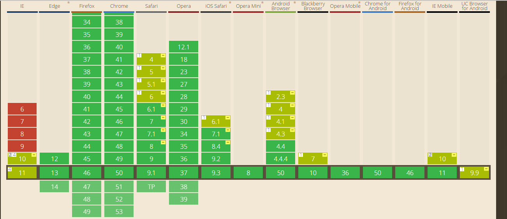
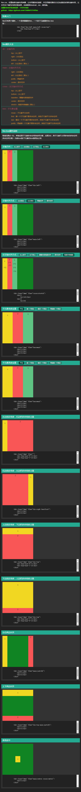

# godcss
移动端布局终极解决方案+神器--- 让移动端布局开发更加容易 http:/www.github.com/cllgeek/godcss/

### 介绍

- `godcss`不是一个库，也不是一个框架。它是一个移动端布局开发解决方案。使用`godcss`可以让移动端布局开发更容易。

- 使用动态的HTML根字体大小和动态的viewport scale。

- 遵循视觉一致性原则。在不同大小的屏幕和不同的设备像素密度下，让你的页面看起来是一样的。

- 不仅便捷了你的布局，同时它使用起来异常简单。可能你会说 `talk is cheap,show me the code`，那我现在列下godcss整个项目的目录结构。

- 抛开圣杯布局,拥抱flex布局

# 第一部分
```javascript
├── example //所有的示例都在这个目录下
│   ├── duang
│   ├── normal
│   └── wolf
│
└── src //主要文件在这里
|   ├── godcss.js
|   ├── px2rem.less
|   ├── px2rem.scss
|   └── px2rem.styl
├── demo //参照的flex布局案例
│   ├── css.css
│   ├── demo.html
|__ data-god.css
|
|__ god.css
```

### 谁在用godcss
- [联塑电商](http://weixin.lessomall.com/public/act/20160728/fjp.html)

### 优势

- 保证不同设备下的统一视觉体验。
- 不需要你再手动设置`viewport`，根据当前环境计算出最适合的`viewport`。
- 支持任意尺寸的设计图，不局限于特定尺寸的设计图。
- 支持单一项目，多种设计图尺寸，专为解决大型，长周期项目。
- 提供`px2rem`转换方法，CSS布局，零成本转换，原始值不丢失。
- 有效解决移动端真实1像素问题。

### 用法

#### 引入godcss.js

```html
<script src="/path/to/godcss.js"></script>
```

根据页面渲染机制，`godcss.js`必须在其他JS加载前加载，万不可异步加载。

如果可以，你应将`godcss.js`的内容以内嵌的方式写到`<head>`标签里面进行加载，并且保证在其他js文件之前。

为了避免不必要的bug，请将CSS放到该JS之前加载。

#### css要怎么写

你可能已经注意到在`src/`目录下有`px2rem.scss/px2rem.less/px2rem.styl`三个文件。没错，这就是`godcss`提供的将px转为rem的方法，可根据您的需要选择使用。

推荐使用scss来编写css，在scss文件的头部使用`import`将`px2rem`导入

```scss
@import '/path/to/px2rem.scss';
```

如果你的项目是单一尺寸设计图，那么你需要去px2rem.scss中定义全局的`designWidth`。
```scss
@function px2rem( $px ){
  @return $px*320/$designWidth/20 + rem;
}
$designWidth : 750; //如设计图是750
```
如果你的项目是多尺寸设计图，那么就不能定义全局的`designWidth`了。需要在你的业务`scss`中单独定义。如以下是`style.scss`
```scss
@import '/path/to/px2rem.scss';
$designWidth : 750; //如设计图是750
```
`$designWidth`必须要在使用`px2rem`前定义。否则scss编译会出错。


注意：如果使用less，则需要引入`less-plugin-functions`，普通的less编译工具无法正常编译。

#### 想用px怎么办？
直接写px肯定是不能适配的，那`godcss.js`会在html上注册`data-dpr`属性，这个属性用来标识当前环境dpr值。那么要使用px可以这么写。
```scss
//scss写法
#container{
  font-size: 12px ;
  [data-dpr="2"] &{
    font-size: 24px;
  }
  [data-dpr="3"] &{
    font-size: 36px;
  }
}
```

### 接口说明

#### initial-dpr
可以通过强制设置dpr。来关闭响应的viewport scale。使得viewport scale始终为固定值。

```html
<meta name="godcss" content="initial-dpr=1">
<script src="/path/to/godcss.js"></script>
<!--
如iphone微信强设dpr=1，则可以长按识别二维码。
注意，强制设置dpr=1后，css中的1px在2x，3x屏上则不再是真实的1px。
-->
```

#### max-width
通过设置该值来优化平板/PC访问体验，注意该值默认值为540。设置为0则该功能关闭。
为了配合使用该设置，请给body增加样式`width:16rem;margin:0 auto;`。
```html
<meta name="godcss" content="max-width=640">
<script src="/path/to/godcss.js"></script>
<!--
默认为540，可根据具体需求自己定义
-->
<style>
body{
  width: 16rem;
  margin: 0 auto;
}
</style>
```

#### design-width
通过对design-width的设置可以在本页运行的JS中直接使用`godcss.px2rem/godcss.rem2px`方法，无需再传递第二个值。

```html
<meta name="godcss" content="design-width=750">
<script src="/path/to/godcss.js"></script>
```

#### godcss.mresize
用于重新计算布局，一般不需要你手动调用。
```javascript
godcss.mresize();
```
#### godcss.callback
触发mresize的时候会执行该方法。
```javascript
godcss.callback = function(){
  //your code here
}
```


#### 单位转换godcss.px2rem/godcss.rem2px
`godcss.px2rem` 和 `godcss.rem2px`。<del>你可以预先设定`godcss.designWidth`</del>可以在meta中设置`design-width`，则之后使用这两个方法不需要再传递第二个参数。

迭代后仍然支持在js中设置`godcss.designWidth`，推荐使用meta去设置。

```javascript
/**
* [px2rem px值转换为rem值]
* @param  {[number]} px          [需要转换的值]
* @param  {[number]} designWidth [设计图的宽度尺寸]
* @return {[number]}             [返回转换后的结果]
*/
godcss.px2rem( px , designWidth );

/**
* 同上。
* 注意：因为rem可能为小数，转换后的px值有可能不是整数，需要自己手动处理。
*/
godcss.rem2px( rem , designWidth );


//你可以在meta中定义design-width，此后使用px2rem/rem2px，就不需要传递designWidth值了。同时也支持旧的设置方式，直接在JS中设置godcss.designWidth
godcss.px2rem(200);
godcss.rem2px(350);
```

# 第二部分:flex布局部分

### 为什么需要flex.css?
```
在移动端开发中，并不是所有的浏览器，webview，微信等各种版本都支持标准的flex，
但是基本上都会支持-webkit-box，所以flex.css的主要作用是保证每一个属性都能支持标准flex或旧版本的-webkit-box。
由于flex.css采用了autoprefixer编译，所以能够保证在浏览器不支持标准flex布局的情况下，
回滚到旧版本的-webkit-box，保证移动设备中能呈现出一样的布局效果。
于是，一款移动端快速布局的神器诞生了...
```

### 优点
```
简洁的api，熟悉的属性值，入门毫无压力。
在html中采用属性的方式布，将布局和css进行分离，清晰的布局结构让你更容易维护，可以在不更改css的情况下更改布局。
特别是在React中使用data-flex属性布局，维护起来更加的方便。
```


### 支持情况
```
flex布局分为旧版本dispaly: box;，过渡版本dispaly: flexbox;，以及现在的标准版本display: flex;

Android
  2.3 开始就支持旧版本 display:-webkit-box;
  4.4 开始支持标准版本 display: flex;

IOS
  6.1 开始支持旧版本 display:-webkit-box;
  7.1 开始支持标准版本 display: flex;

PC
  如果你不需要兼容ie10以下版本，也是可以使用flex.css

flex.css同时能兼容新版本和旧版本，保证了浏览器不支持新版本时，回退到旧版本。
```


### 使用
```html
<!--
  将dist目录下的css文件引入到你的页面中，根据你的需要引入
  flex.css 使用flex属性匹配
  data-flex.css 使用data-flex属性匹配（React使用）
  如果使用了webpack打包，npm安装后，并且配置了ES6编译器的话，
  flex 属性匹配可以直接使用：
    import 'flex.css';
  data-flex 属性匹配可以直接使用(react使用)
    import 'data-flex.css';
 -->
<!-- flex属性匹配，简单的子元素居中例子： -->
  <div flex="main:center cross:center" style="width:500px; height: 500px; background: #108423">
    <div style="background: #fff">看看我是不是居中的</div>
  </div>

<!-- data-flex属性匹配，简单的子元素居中例子： -->
  <div data-flex="main:center cross:center" style="width:500px; height: 500px; background: #f1d722">
    <div style="background: #fff">看看我是不是居中的</div>
  </div>
```
### flex属性大全
```
dir：主轴方向
    top：从上到下
    right：从右到左
    bottom：从上到下
    left：从左到右（默认）
```
```
main：主轴对齐方式
    right：从右到左
    left：从左到右（默认）
    justify：两端对齐
    center：居中对齐
```
```
cross：交叉轴对齐方式
    top：从上到下
    bottom：从上到下
    baseline：跟随内容高度对齐
    center：居中对齐
    stretch：高度并排铺满（默认）
```
```
box：子元素设置
    mean：子元素平分空间
    first：第一个子元素不要多余空间，其他子元素平分多余空间
    last：最后一个子元素不要多余空间，其他子元素平分多余空间
    justify：两端第一个元素不要多余空间，其他子元素平分多余空间
```

### flex-box属性说明
```
取值范围(0-10)，单独设置子元素多余空间的如何分配，设置为0，则子元素不占用多余的多余空间
多余空间分配 = 当前flex-box值/子元素的flex-box值相加之和
```
### 其他
```
深圳html5开发者社群：170761660
NodeJS前端分享群：133240225
```

### demo.html测试截图



### 辅助开发资源

- [koala<中文，免费>](http://koala-app.com/index-zh.html)
- [codekit<功能丰富，收费>](http://incident57.com/codekit/)
